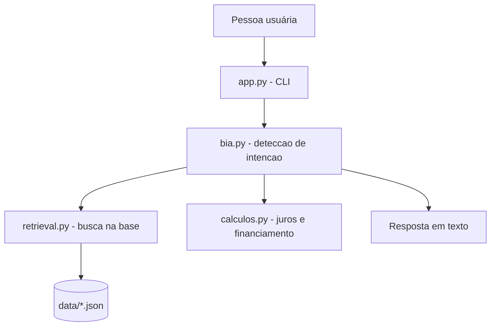

# 💬 Bia — Assistente de Relacionamento Financeiro

> Projeto do Lab "Construa Seu Assistente Virtual Com Inteligência Artificial" (DIO).
> Agente que explica conceitos financeiros, simula cálculos e ajuda a pessoa
> usuária a entender seus próprios gastos — sem inventar informação.

## 💡 O que é a Bia?

A Bia é uma assistente que **ensina e organiza**, não recomenda investimentos.
Ela responde com base em uma base de conhecimento fixa, faz simulações
financeiras determinísticas (juros compostos, financiamento) e usa um perfil
fictício de usuária para exemplificar respostas personalizadas sobre gastos
e saldo.

**O que a Bia faz:**
- ✅ Explica conceitos financeiros (CDI, Selic, reserva de emergência, Tesouro Direto, etc.)
- ✅ Simula juros compostos e financiamentos com números reais informados pela pessoa
- ✅ Analisa gastos de um perfil de exemplo de forma organizada
- ✅ Mantém contexto entre perguntas (ex.: "e se fossem 24 meses?")
- ✅ Admite quando não sabe, em vez de inventar

**O que a Bia NÃO faz:**
- ❌ Não recomenda comprar/vender produtos financeiros específicos
- ❌ Não acessa dados bancários reais (usa apenas dados fictícios de exemplo)
- ❌ Não substitui um profissional certificado

## 🏗️ Arquitetura



**Stack:** Python 3 puro, sem dependências externas e **sem chamada a
nenhuma API de IA generativa** — as respostas vêm de busca na base de
conhecimento + templates + cálculos reais (ver decisão documentada em
`docs/01-documentacao-agente.md`).

## 📁 Estrutura do projeto

```
assistente-virtual-ia/
├── data/
│   ├── base_conhecimento.json     # Conceitos financeiros (FAQ)
│   ├── produtos_financeiros.json  # Catálogo de produtos
│   └── perfil_usuario.json        # Perfil fictício para personalização
│
├── docs/
│   ├── 01-documentacao-agente.md  # Persona, objetivo, limites
│   ├── 02-base-conhecimento.md    # Estratégia de dados e busca
│   ├── 03-prompts.md              # Especificação de comportamento
│   ├── 04-avaliacao-metricas.md   # Casos de teste reais e métricas
│   └── 05-pitch.md                # Problema, solução e aprendizados
│
├── src/
│   ├── retrieval.py                # Busca por similaridade na base
│   ├── calculos.py                 # Juros compostos e financiamento
│   ├── bia.py                      # Núcleo de conversa (intenção + resposta)
│   └── app.py                      # Aplicação CLI
│
└── README.md
```

## 🚀 Como executar

Requisito: apenas Python 3.8+ (nenhuma biblioteca externa é necessária).

```bash
cd src
python app.py
```

Exemplos de perguntas para testar:
```
o que é CDI?
quanto rende 1000 reais em 12 meses a 1% ao mes?
e se fossem 24 meses?
onde estou gastando mais?
simular financiamento de 20000 reais em 36 meses a 1,5% ao mes
qual produto voce indica para reserva de emergencia?
sair
```

## 🎯 Exemplo de uso

```
Você: o que é CDI?
Bia: CDI (Certificado de Depósito Interbancário) é uma taxa de referência
usada pelos bancos para operações entre si. Na prática, ela serve como um
termômetro para investimentos de renda fixa...

Você: onde estou gastando mais?
Bia: Olhando seus gastos deste mês, o total foi de R$ 2775.00. A maior
categoria é 'moradia', com R$ 1380.00 (49.7% do total). Isso é bem comum!
Quer que eu explique alguma estratégia de organização de gastos?
```

## 📊 Avaliação

Testado com 11 casos de teste reais (conceitos, cálculos, personalização,
continuidade de contexto e perguntas fora de escopo). Resultado: 11/11 casos
retornaram a categoria de resposta esperada, com zero alucinações. Detalhes
completos em [`docs/04-avaliacao-metricas.md`](docs/04-avaliacao-metricas.md).

## 📝 Documentação completa

Toda a documentação do processo (persona, base de conhecimento, prompts,
avaliação e pitch) está na pasta [`docs/`](docs/).
